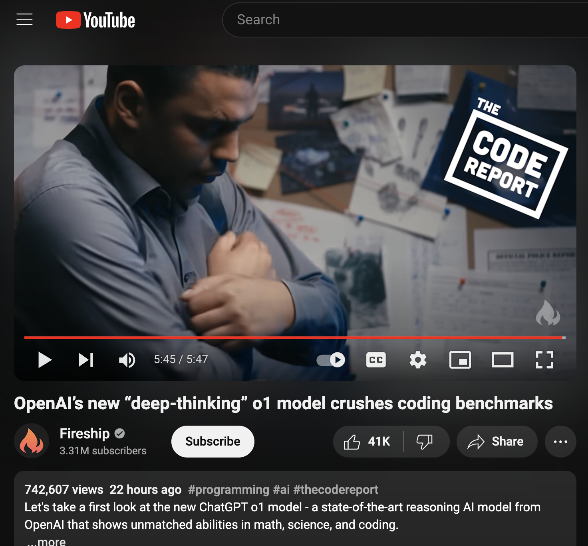
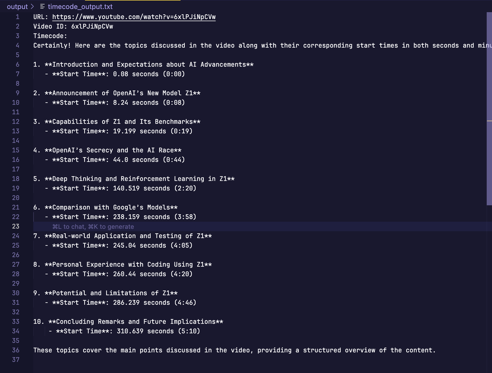

<!-- PROJECT LOGO -->
<br />
<div align="center">
    
    
  </a>
  

  <h2 align="center">YouTube Scraper</h2> <p align="center"> Scripts for automating YouTube video transcripts, timecodes, summaries, and tags.
 </p> 


[![Github][github]][github-url]

 </div>

<!-- TABLE OF CONTENTS -->
## Table of Contents
<ol>
    <a href="#about">📝 About</a>
        <ul>
        </ul>
    <a href="#how-to-build">💻 How to build</a><br/>
    <a href="#next-steps">🚀 Next steps</a> 
       <ul>
        </ul>
    <a href="#tools-used">🔧 Tools used</a>
        <ul>
        </ul>
    <a href="#contact">👤 Contact</a>
  </ol>


<br ></br>

<!-- ABOUT -->
## 📝 About

This project provides a set of Python scripts for automating YouTube video analysis. It includes functionality for extracting transcripts, generating summaries, creating tags, and identifying key topics with timecodes. The scripts utilize the YouTube Transcript API and OpenAI's GPT models to process and analyze video content.

## 💻 How to build 
_Note: macOS version, adjust accordingly for Windows / Linux_

### Initial setup

1. Clone the repo.
2. Copy `.env.example` and rename to `.env`:

```
OPENAI_API_KEY=your_openai_api_key_here
YOUTUBE_URL=https://www.youtube.com/watch?v=video_id_here
```

3. Install the required dependencies:

```
pip install -r requirements.txt
```

### Usage

1. Set the `YOUTUBE_URL` in your `.env` file to the desired YouTube video.

2. Run the scripts:

- For transcript extraction:
    ```
    python transcript.py
    ```

- For summary and tags:
    ```
    python gpt.py
    ```

- For topic timecodes:
    ```
    python timecode.py
    ```

3. Check the `output` folder for the generated files.


### Examples

Using this video from Fireship: https://www.youtube.com/watch?v=6xlPJiNpCVw



For transcript extraction:
 
 

For summary and tags:

 


For topic timecodes:

 


## 🚀 Next Steps

- Implement error handling and input validation
- Add support for batch processing multiple videos
- Create a user-friendly command-line interface
- Integrate with a web framework for a graphical user interface
- Implement caching to reduce API calls and improve performance

## 🔧 Tools Used

[![Python][python]][python-url]
[![OpenAI][openai]][openai-url]
[![YouTube Transcript API][youtube-transcript-api]][youtube-transcript-api-url]

<!-- CONTACT -->
## 👤 Contact

[![Email][email]][email-url]
[![Twitter][twitter]][twitter-url]

<!-- MARKDOWN LINKS & IMAGES -->
[Python]: https://img.shields.io/badge/python-3670A0?style=for-the-badge&logo=python&logoColor=ffdd54
[Python-url]: https://www.python.org/

[OpenAI]: https://img.shields.io/badge/OpenAI_GPT--4-0058A0?style=for-the-badge&logo=openai&logoColor=white&color=4aa481
[OpenAI-url]: https://openai.com/

[youtube-transcript-api]: https://img.shields.io/badge/YouTube_Transcript_API-FF0000?style=for-the-badge&logo=youtube&logoColor=white
[youtube-transcript-api-url]: https://github.com/jdepoix/youtube-transcript-api


[email]: https://img.shields.io/badge/Email-FFCA28?style=for-the-badge&logo=Gmail&logoColor=00bbff&color=black
[email-url]: mailto:me@vd7.io

[twitter]: https://img.shields.io/badge/Twitter-FFCA28?style=for-the-badge&logo=Twitter&logoColor=00bbff&color=black
[twitter-url]: https://twitter.com/vdutts7

[github]: https://img.shields.io/badge/Github-2496ED?style=for-the-badge&logo=github&logoColor=white&color=black
[github-url]: https://github.com/vdutts7/youtube-scraper